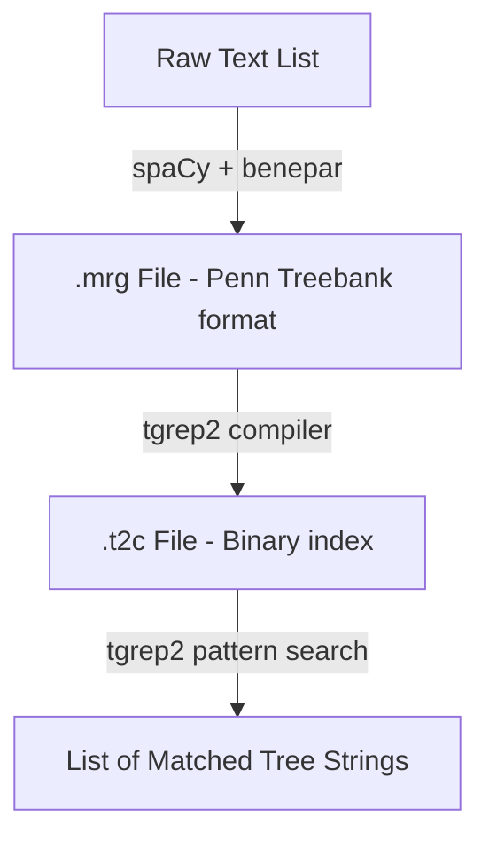

# pytgrep2

[](LICENSE)
[](https://www.python.org/downloads/)
[](#)

`pytgrep2` is a high-performance Python-wrapped linguistic analysis pipeline that coordinates constituency parsing, binary corpus indexing, and structural tree searches. It wraps two refactored variants of the classic C-based `tgrep2` tool, updated and optimized to compile and run on modern Linux environments. Additionally, it integrates Google GenAI to automatically generate complex TGrep2 query patterns from natural language descriptions and to execute hybrid syntactically-filtered semantic analysis pipelines.

---

## Pipeline Architecture

The `TgrepOrchestrator` pipeline operates on a robust, file-based workflow:



1. **Parsing**: Segment and parse raw text strings into constituency trees, formatted into Penn Treebank (`.mrg`) syntax.
2. **Indexing**: Compile the `.mrg` file into a binary `.t2c` search index using the `tgrep2` compiler.
3. **Searching**: Query the compiled `.t2c` index using standard `tgrep2` pattern syntax to extract matching tree fragments.

---

## Key Features

### 1. High-Performance Linguistic Orchestration (`TgrepOrchestrator`)
The `TgrepOrchestrator` coordinates parsing, compiling, and querying via standard TGrep2 pattern syntax without writing custom shell scripts.
- **Double-Engine Support**: Ships with two refactored and optimized versions of `tgrep2`: `tgrep2-andreasvc` and `tgrep2-bwaldon`.
- **Lazy Model Loading**: Large NLP models (spaCy and benepar) are only loaded into memory when parsing is first invoked, keeping initial imports fast.
- **High-Throughput Batching**: Leverages spaCy's optimized multi-threaded `nlp.pipe` batching logic to parse large corpora efficiently.
- **Command Injection Safety**: Executes all underlying C binaries via `subprocess.run(shell=False)` with strict argument arrays, preventing shell-expansion vulnerabilities.

### 2. Natural Language Query Translation (`TgrepQueryGenerator`)
The `TgrepQueryGenerator` translates plain English syntactic descriptions into valid TGrep2 query patterns using Gemini models.
- **Query Validation**: Automatically compiles and tests the generated pattern to verify its syntax.
- **Self-Correction Loop**: If validation fails, it feeds the C-engine's exact compiler error back to Gemini for automatic revision.
- **Compressed Query Cache**: Saves translation latency and API costs by caching successful queries locally in a compressed gzip pickle database.

### 3. Syntactically-Filtered Semantic Analysis (`TgrepSemanticAnalyzer`)
The `TgrepSemanticAnalyzer` coordinates a hybrid NLP workflow that combines high-performance structural pruning with LLM semantic reasoning.
- **Hybrid Efficiency**: Prunes/filters large corpora using TGrep2 syntactic queries first, and then sends only the matching sentences to Gemini for deep semantic analysis (e.g., extracting claims, identifying arguments, analyzing sentiment).
- **Match Grouping**: Groups multiple matched subtrees in a single sentence to minimize API calls and token usage.
- **Metadata Alignment**: Automatically aligns matched sentences with source metadata (e.g. author, genre, year) for context-rich prompting.

---

## Prerequisites & Installation

### 1. C-Binary Compilation

Ensure you have a GCC compiler and GNU Make installed on your system. Run the following command from the repository root to compile both `tgrep2` engines:

```bash
make install
```

This compiles the engines and stores the executables in the `bin/` directory:
- `bin/tgrep2-andreasvc`
- `bin/tgrep2-bwaldon`

### 2. Python Dependencies

You can install the package and all its Python dependencies (including `google-genai` and `compress-pickle`) directly using:

```bash
pip install .
```

To configure the spaCy and Benepar parsing models, run:

```bash
python -m spacy download en_core_web_sm
python -c "import benepar; benepar.download('benepar_en3')"
```

---

## Quick Start Examples

### Using `TgrepOrchestrator`

Here is a complete, runnable example showing how to initialize the orchestrator, parse raw sentences, compile an index, and run a query for noun phrases (`NP`) dominating an adjective (`JJ`):

```python
from pathlib import Path
from pytgrep2 import TgrepOrchestrator

# Initialize the orchestrator (resolves to bin/tgrep2-andreasvc by default)
orchestrator = TgrepOrchestrator()

# Define the corpus text
corpus = [
    "The quick brown fox jumps over the lazy dog.",
    "A smart dog barked at the moon.",
    "Active learning pipelines parse structures efficiently."
]

mrg_file = Path("corpus.mrg")
t2c_file = Path("corpus.t2c")

try:
    # 1. Parse text to Penn Treebank format (.mrg)
    print("Parsing text...")
    orchestrator.parse_to_mrg(corpus, mrg_file)

    # 2. Compile .mrg file into .t2c binary index
    print("Compiling index...")
    orchestrator.index_corpus(mrg_file, t2c_file)

    # 3. Query the index (NP dominating JJ)
    pattern = "NP < JJ"
    print(f"Searching for pattern: '{pattern}'")
    matches = orchestrator.search_index(pattern, t2c_file, additional_args=["-a"])

    print(f"\nFound {len(matches)} matches:")
    for idx, match in enumerate(matches):
        print(f"  [{idx + 1}] {match}")

finally:
    # Clean up temporary files
    for p in [mrg_file, t2c_file]:
        if p.exists():
            p.unlink()
```

### Using `TgrepQueryGenerator`

Translate natural language syntax requests into valid patterns:

```python
import os
from pytgrep2 import TgrepQueryGenerator

# Ensure your GEMINI_API_KEY environment variable is configured
api_key = os.getenv("GEMINI_API_KEY")

generator = TgrepQueryGenerator(api_key=api_key)
description = "A verb phrase dominating a modal auxiliary verb which immediately precedes another verb phrase"

pattern = generator.generate_pattern(description)
print(f"Generated TGrep2 Pattern: {pattern}")
```

### Using `TgrepSemanticAnalyzer`

Run a hybrid syntactic filtering and Gemini semantic analysis loop:

```python
import os
from pytgrep2 import TgrepSemanticAnalyzer

api_key = os.getenv("GEMINI_API_KEY")
analyzer = TgrepSemanticAnalyzer(api_key=api_key)

corpus = [
    "They are inspiring leaders, even though I disagree with much of what they say.",
    "Although the process is sophisticated, sometimes it goes wrong."
]

results = analyzer.analyze_corpus(
    corpus=corpus,
    pattern_or_desc="SBAR < (IN < /^(although|though|whereas)$/)",
    semantic_task="Identify the opposing viewpoints and which one the author favors.",
    is_pattern=True
)

for res in results:
    print(f"\nSentence: {res['sentence']}")
    print(f"Analysis: {res['analysis']}")
```

---

## Running Tests

`pytgrep2` includes a comprehensive test suite that validates and compares the outputs of both `tgrep2` engine binaries against various operators described in the TGrep2 manual.

To run the tests, run:

```bash
make test
```

Or execute the scripts directly:

```bash
# Run comprehensive tests
python3 tests/run_tests.py

# Run manual pattern verification tests
python3 examples/check_manual_patterns.py
```

---

## Repository Layout

```
.
├── bin/                          # Target output directory for compiled tgrep2 binaries
├── demos/                        # High-level demo applications (e.g. literary analysis)
├── docs/                         # Detailed tutorials, guides, and reference material
├── examples/                     # Code examples and manual verification scripts
├── mrg-t2c/                      # Temporary and sample corpus files
├── pytgrep2/                     # Main Python library source package
│   ├── __init__.py
│   ├── query_generator.py        # Natural language query generator class
│   ├── semantic_analyzer.py      # Syntactically-filtered semantic analyzer class
│   └── tgrep_orchestrator.py     # Main Python orchestrator class
├── tests/                        # Automated unit tests and test corpora
├── tgrep2-andreasvc-refactored/   # Refactored C source code of the andreasvc version
├── tgrep2-bwaldon-refactored/     # Refactored C source code of the bwaldon version
├── LICENSE                       # MIT License
└── README.md                     # This file
```

---

## Documentation Index

For detailed deep-dives, refer to the documents in the [docs/](docs/) directory:

- **[Installation & Binary Configuration](docs/tgrep2_installation_guide.md)**: Details on prerequisites, compilation commands, and setting custom binary paths.
- **[NLP Tutorial](docs/pytgrep2_tutorial.md)**: Walkthrough of writing NLP programs, including standard syntactic pattern operator cheat sheets.
- **[API Reference](docs/pytgrep2_api_reference.md)**: Complete details of the `TgrepOrchestrator` methods and signatures.
- **[GenAI Integration Workflows](docs/Suggested Workflows.md)**: Walkthrough of the hybrid pipelines integrating `pytgrep2` with Google GenAI (`TgrepQueryGenerator` and `TgrepSemanticAnalyzer`).
- **[Workflows Relevance for Literary Corpora](docs/why_this_workflow_is_relevant_for_literary_analysis.md)**: Conceptual and technical explanation of why hybrid workflows are crucial for scaling analysis on multi-author corpora like literary or scientific collections.
- **[Pattern Writing Tutorial](docs/tgrep2_patterns_tutorial.md)**: Comprehensive guide to advanced structural pattern queries in tgrep2.
- **[Output Formatting Tutorial](docs/tgrep2_output_formatting_tutorial.md)**: Guide to custom search layouts and formatting flags.
- **[Performance & Optimization Guide](docs/tgrep2_performance_optimization_guide.md)**: How to scale searches to massive corpora.
- **[Defaults and Scaling](docs/tgrep2_defaults_and_scaling.md)**: Reference sheet for built-in constants, limits, and scaling characteristics.
