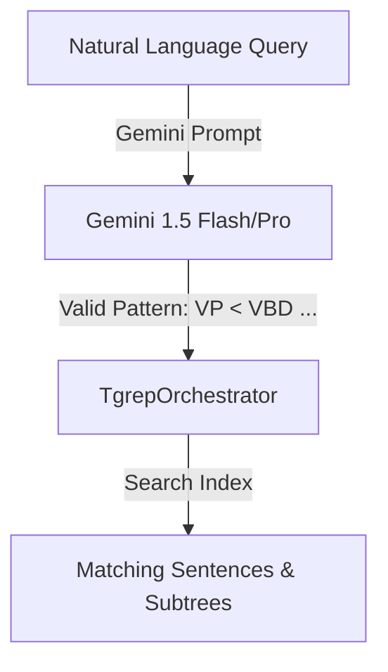
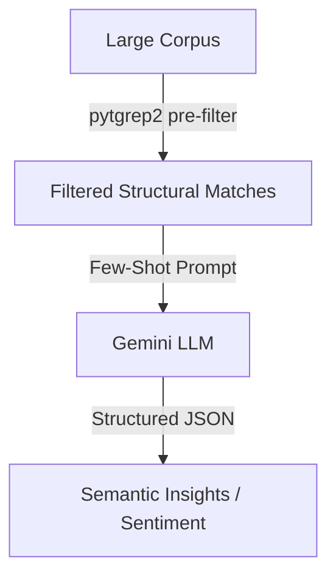
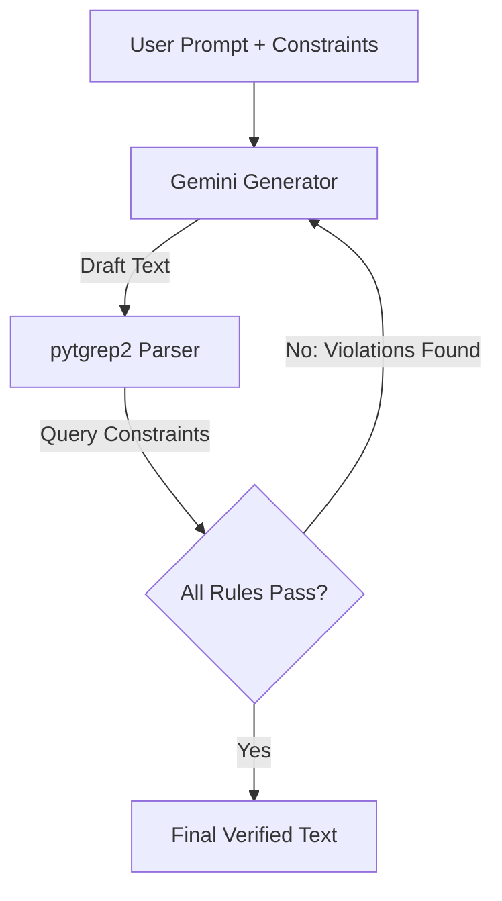
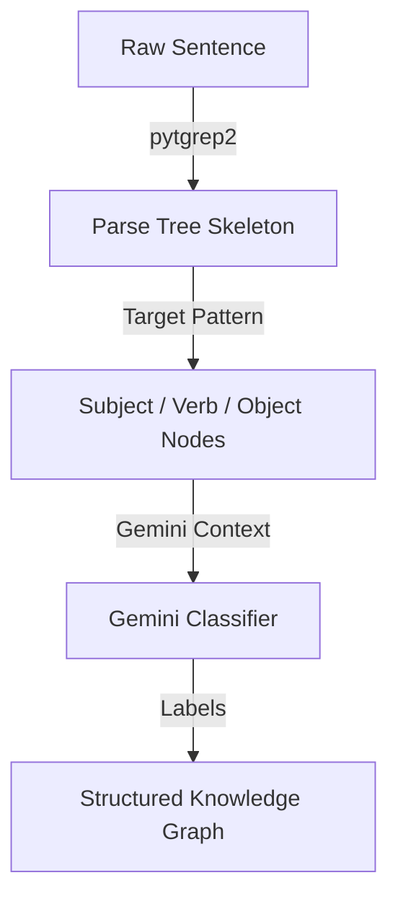
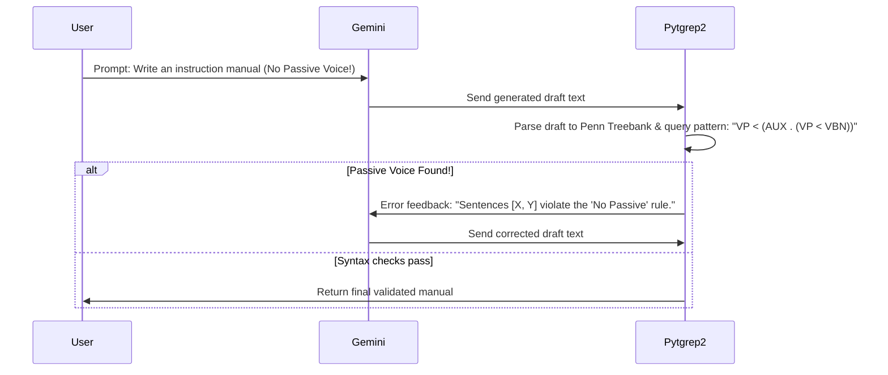

# Integrating Pytgrep2 Syntactic Search with Google GenAI

This document presents four powerful integration workflows that combine the precise, high-performance structural search capabilities of `pytgrep2` (using spaCy/benepar constituency trees and binary C-based indexing) with the semantic reasoning, generation, and instruction-following abilities of Google GenAI (Gemini).

---

## Overview: The Synergy

| Feature | `pytgrep2` (Constituency Parser + C-Engine) | Google GenAI (Gemini) |
| :--- | :--- | :--- |
| **Strengths** | Strict grammatical matching, zero hallucination, sub-millisecond execution, scales to millions of trees locally. | Deep semantic comprehension, context awareness, stylistic rewriting, natural language generation. |
| **Weaknesses** | No semantic understanding, cannot handle synonyms/intents, rigid pattern syntax, cannot rewrite text. | Poor/unreliable at strict syntactic constraint validation, expensive at scale, potential to hallucinate structural relationships. |

By combining them, we create a hybrid pipeline that uses **`pytgrep2` for structural pruning/validation** and **Gemini for semantic reasoning/generation**.

---

## Suggested Workflows

````carousel
# Workflow 1: NL-to-TGrep2 Query Assistant
### Concept
Enable users to write search queries in plain English (e.g., *"Find sentences where a past-tense verb is immediately followed by a direct object that contains an adjective"*). Gemini translates this request into a valid TGrep2 query pattern, which is then executed against the index.



### Prompt Strategy
The system prompt contains the full TGrep2 operator syntax guide and few-shot examples translating English structural descriptions to patterns.
<!-- slide -->
# Workflow 2: Syntactically-Filtered Semantic Analysis
### Concept
Running LLM analysis on large corpora is slow and expensive. Use `pytgrep2` to run an initial, ultra-fast structural pre-filter to find specific grammatical constructions (e.g., conditional statements, concession clauses, reported speech), and then send only the matches to Gemini for deep semantic extraction.



### Example: Claim Extraction
- **TGrep2 Pattern**: `SBAR < (IN < /^(although|though|whereas)$/)` (Finds concession/contrast structures)
- **Gemini Task**: Analyze the opposing arguments and identify which viewpoint the author favors.
<!-- slide -->
# Workflow 3: Guardrailed Style & Complexity Generation
### Concept
Generate text using Gemini under strict syntactic and grammatical constraints (e.g., target reading levels, Simplified Technical English). The output is parsed and verified by `pytgrep2` in a feedback loop.



### Self-Correction Prompt
If violations (e.g., passive voice structures, nested clauses) are found by `pytgrep2`, it sends the exact sentences and structural errors back to Gemini to rewrite.
<!-- slide -->
# Workflow 4: Structural Semantic Role Labeling (SRL)
### Concept
Combine the structural parser skeleton with LLM class labelling to extract highly accurate semantic roles (Agent, Patient, Action) without the parsing drift or hallucinations common in end-to-end LLM information extraction.



### How it works
`pytgrep2` identifies components using patterns like `S < (NP=subj) < (VP < (/^VB/=verb) < (NP=obj))`. Gemini is then asked to classify the semantic roles and resolve pronouns.
````

---

## 1. NL-to-TGrep2 Query Assistant (Workflow 1)

This workflow is implemented via the `TgrepQueryGenerator` class. It translates plain English descriptions of syntactic structures into valid TGrep2 search query patterns, handles local query caching to save API costs, and runs an automatic self-correction feedback loop if the compiled C-engine reports a syntax error in the generated pattern.

### Programming Example

```python
import os
from pytgrep2 import TgrepQueryGenerator

# 1. Retrieve the Google GenAI API key
api_key = os.getenv("GEMINI_API_KEY") or os.getenv("GOOGLE_API_KEY")

# 2. Initialize the generator
# It caches successful translations locally in a compressed pickle file.
generator = TgrepQueryGenerator(
    cache_path="tgrep_query_cache.pkl.gz",
    api_key=api_key,
    model="gemini-3.1-flash-lite"
)

# 3. Translate a natural language syntactic description to a TGrep2 query pattern
description = "A verb phrase dominating a modal auxiliary verb which immediately precedes another verb phrase"
try:
    pattern = generator.generate_pattern(description)
    print(f"NL Description   : \"{description}\"")
    print(f"Generated Pattern: {pattern}")
except RuntimeError as e:
    print(f"Failed to generate pattern: {e}")
```

---

## 2. Syntactically-Filtered Semantic Analysis (Workflow 2)

This workflow is implemented via the `TgrepSemanticAnalyzer` class. It uses the compiled `tgrep2` binary to run high-performance syntactic filtering on the corpus (either raw text, an `.mrg` parse tree file, or a compiled `.t2c` / `.t2c.gz` index) and sends only the matching sentences to Google's Gemini models for fine-grained semantic analysis.

Key features:
- **Index Support**: Native support for compressed index `.t2c.gz` files without decompression.
- **Grouping**: Groups multiple matched subtrees in a single sentence to run a single, token-efficient Gemini API call.
- **Metadata Alignment**: Automatically aligns matches with user-provided list or dictionary metadata.
- **Custom Prompts**: Allows passing a `custom_prompt_formatter` callback to customize prompts.

A complete, runnable example of this workflow is provided in the [literary_analysis_demo.py](../demos/literary_analysis_demo.py) script.

### Programming Example

```python
import os
from pytgrep2 import TgrepSemanticAnalyzer

# 1. Retrieve the Google GenAI API key
api_key = os.getenv("GEMINI_API_KEY") or os.getenv("GOOGLE_API_KEY")

# 2. Initialize the semantic analyzer
# Defaults to using 'gemini-3.1-flash-lite' for cost-effective, high-speed reasoning.
analyzer = TgrepSemanticAnalyzer(api_key=api_key, model="gemini-3.1-flash-lite")

# 3. Define raw corpus list (can also pass path to a .mrg file or .t2c.gz index)
corpus = [
    "They are inspiring leaders, even though I disagree with much of what they say.",
    "Although the process is sophisticated, sometimes it goes wrong.",
    "The quick brown fox jumps over the lazy dog."
]

# Optional metadata mapped to each sentence by index
metadata = [
    {"talk": "Talk A", "url": "https://example.com/talk-a"},
    {"talk": "Talk B", "url": "https://example.com/talk-b"},
    {"talk": "Talk C", "url": "https://example.com/talk-c"}
]

# 4. Perform Syntactically-Filtered Semantic Analysis
# Filter for concession/contrast SBAR structures and analyze opposing viewpoints.
results = analyzer.analyze_corpus(
    corpus=corpus,
    pattern_or_desc="SBAR < (IN < /^(although|though|whereas)$/)",
    semantic_task="Identify the opposing viewpoints and which one the author favors.",
    metadata=metadata,
    is_pattern=True,           # Set to False to translate pattern_or_desc from NL
    max_results=5,             # Limit API calls
    case_insensitive=True
)

# 5. Output results
print(f"Matched {len(results)} sentences:\n")
for idx, res in enumerate(results, 1):
    print(f"[{idx}] Sentence #{res['sentence_index'] + 1}")
    print(f"  Metadata  : {res['metadata']}")
    print(f"  Sentence  : \"{res['sentence']}\"")
    print(f"  Subtrees  : {res['subtrees']}")
    print(f"  Analysis  :\n{res['analysis']}\n")
```

---

## 3. Syntactic Guardrails on LLM Generation (Workflow 3)

Using a feedback loop to guarantee that LLM-generated output complies with structural constraints (e.g. Simplified Technical English rules).



---

## 4. Structural Semantic Role Labeling (Workflow 4)

Extract semantic roles (Agent, Patient, Action) by querying the parse tree skeleton and passing exact matched nodes and their sentence context to Gemini for labeling and coreference resolution.

---

## Summary of Added Components

| Class Name | Module Path | Purpose | Key Methods |
| :--- | :--- | :--- | :--- |
| `TgrepQueryGenerator` | `pytgrep2.query_generator` | Translate Natural Language to valid TGrep2 patterns | `generate_pattern(description, max_retries)` |
| `TgrepSemanticAnalyzer` | `pytgrep2.semantic_analyzer` | Prune search space with TGrep2 & analyze with Gemini | `analyze_corpus(corpus, pattern_or_desc, semantic_task, ...)` |

