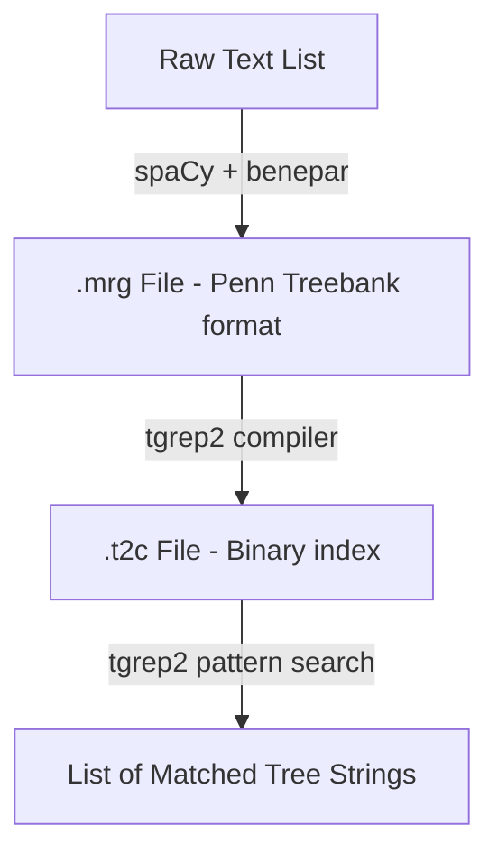

# Tutorial: Writing NLP Programs with pytgrep2 and TGrep2

This tutorial guides you through the process of building natural language processing (NLP) pipelines that leverage constituency parsing and structural tree searches. We will use the python-wrapped `TgrepOrchestrator` to coordinate spaCy + benepar (constituency parsing) and the legacy `tgrep2` binary (corpus indexing and syntactic pattern matching).

---

## 1. Pipeline Workflow Overview

The orchestrator operates on a file-based workflow:



1. **Parsing**: Segment and parse raw text strings into constituency trees, formatting them into Penn Treebank (`.mrg`) syntax.
2. **Indexing**: Compile the `.mrg` file into a binary `.t2c` search index using the `tgrep2` compiler.
3. **Searching**: Query the compiled `.t2c` index using standard `tgrep2` pattern syntax to extract matching tree fragments.

---

## 2. Setting Up the Environment

To use the orchestrator, ensure your Python environment contains the necessary parsing dependencies:

```bash
# 1. Install spaCy, benepar, and NLTK
pip install spacy benepar nltk

# 2. Download parsing models
python -m spacy download en_core_web_sm
python -c "import benepar; benepar.download('benepar_en3')"
```

---

## 3. Creating Your First NLP Program

Here is a complete, modular program using `TgrepOrchestrator` to parse sentences and query for specific grammatical structures:

```python
from pathlib import Path
from tgrep_orchestrator import TgrepOrchestrator

def main():
    # 1. Initialize Orchestrator
    # By default, it resolves to the robust 'bin/tgrep2-andreasvc' executable
    orchestrator = TgrepOrchestrator()
    
    # 2. Define Raw Text
    corpus = [
        "A smart dog barked at the moon.",
        "The cat chased a fast mouse under the table.",
        "Active learning pipelines parse text structures efficiently."
    ]
    
    mrg_path = Path("nlp_corpus.mrg")
    t2c_path = Path("nlp_corpus.t2c")
    
    try:
        # 3. Parse Raw Text to Penn Treebank Format
        print("Parsing raw text sentences to .mrg format...")
        # parse_to_mrg writes parses line-by-line and returns NLTK Tree objects
        trees = orchestrator.parse_to_mrg(corpus, mrg_path)
        print(f"Generated {len(trees)} trees in {mrg_path}.\n")
        
        # 4. Compile into a TGrep2 Index File
        print("Compiling .mrg to .t2c index...")
        orchestrator.index_corpus(mrg_path, t2c_path)
        print(f"Compiled index: {t2c_path}\n")
        
        # 5. Search using Syntactic Patterns
        # Example query: Find noun phrases (NP) dominating adjectives (JJ)
        pattern = "NP < JJ"
        print(f"Searching for noun phrases dominating adjectives: '{pattern}'")
        matches = orchestrator.search_index(pattern, t2c_path, additional_args=["-a"])
        
        print(f"Found {len(matches)} matching subtrees:")
        for idx, match in enumerate(matches):
            print(f"  [{idx + 1}] {match}")
            
    finally:
        # 6. Clean up temporary files
        for p in [mrg_path, t2c_path]:
            if p.exists():
                p.unlink()

if __name__ == "__main__":
    main()
```

---

## 4. TGrep2 Syntactic Pattern Syntax Cheat Sheet

`tgrep2` is an extremely powerful language for expressing relationships in tree structures. Below are the most common relationship operators you can use inside `search_index`:

| Pattern Operator | Relationship Description | Example Query | Meaning |
| :--- | :--- | :--- | :--- |
| `A < B` | `A` is the parent of (immediately dominates) `B`. | `VP < VB` | Verb Phrase immediately dominating a base-form Verb. |
| `A << B` | `A` dominates `B` (is an ancestor of `B`). | `S << PRP` | Sentence dominating a Pronoun at any depth level. |
| `A > B` | `A` is the child of `B`. | `NNP > NP` | Proper Noun which is a child of a Noun Phrase. |
| `A <, B` or `A <1 B` | `B` is the first child of `A`. | `NP <, DT` | Noun Phrase whose first child is a Determiner. |
| `A <- B` or `A <` B` | `B` is the last child of `A`. | `PP <- NP` | Prepositional Phrase whose last child is a Noun Phrase. |
| `A <: B` | `B` is the only child of `A`. | `NP <: NNP` | Noun Phrase containing exactly one child, which is a Proper Noun. |
| `A . B` | `A` immediately precedes `B`. | `DT . JJ` | Determiner immediately preceding an Adjective. |
| `A .. B` | `A` precedes `B` at any distance. | `NP .. VP` | Noun Phrase preceding a Verb Phrase in linear order. |
| `A $ B` | `A` is a sister of `B` (same parent, `A != B`). | `NP $ VP` | Noun Phrase and Verb Phrase sharing the same parent node. |
| `A $. B` | `A` is a sister of and immediately precedes `B`. | `NP $. VP` | Noun Phrase immediately preceding its sister Verb Phrase. |
| `/regex/` | Regular expression matching for node labels. | `NP < /VB.*/` | Noun Phrase dominating any Verb-related node (VB, VBZ, VBD, etc.). |

### Querying Logical Operators (AND, OR, NOT)

- **Conjunction (AND)**: Implicit by chaining relations.
  `NP < NNP < CD` matches an `NP` that has both an `NNP` child and a `CD` child.
- **Disjunction (OR)**: Indicated using the pipe `|` symbol with a relation.
  `NP < NNP | < PRP` matches an `NP` dominating a Proper Noun **OR** dominating a Pronoun.
- **Negation (NOT)**: Indicated using the exclamation mark `!`.
  `NP !< VP` matches an `NP` that does **not** dominate a Verb Phrase.

---

## 5. Security & Performance Best Practices

### Preventing Command Injection
Never build commands using string formatting when executing CLI tools in Python. The `TgrepOrchestrator` mitigates injection by running binaries with **`shell=False`**, passing arguments as a strictly formatted string array. This isolates arguments from shell expansion:
```python
# SECURE (Used inside TgrepOrchestrator)
cmd = [str(self.tgrep2_binary_path), "-c", str(t2c_path), pattern]
subprocess.run(cmd, shell=False)
```

### Optimizing Throughput for Large Corpora
1. **Lazy Loading**: spaCy and benepar models are heavy and slow to import. Instantiating `TgrepOrchestrator()` does not load models immediately. They are loaded dynamically on the first invocation of `parse_to_mrg`.
2. **Batched Pipelines**: Avoid parsing sentences in a loop (`for s in sentences: nlp(s)`). Instead, pass them to `parse_to_mrg` as a list, which leverages spaCy's optimized multi-threaded `nlp.pipe(batch_size=64)` batching logic.
3. **Caching**: Index files (`.t2c`) do not need to be compiled repeatedly. Check for their existence on disk and only index if the source `.mrg` file has changed.
