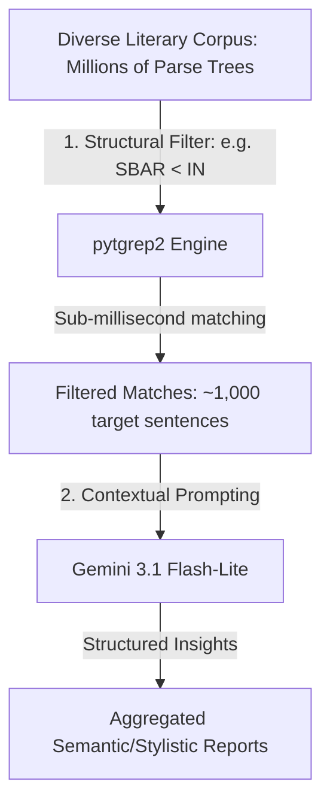

# Why Filtered Semantic Analysis is Relevant for Diverse Literary & Scientific Corpora

Diverse literary and scientific corpora contain millions of parsed sentences spanning hundreds of authors, genres, historical epochs, and writing styles. Analyzing such datasets presents unique scaling, stylistic, and semantic challenges.

This document explains why combining structural search (`pytgrep2`) with large language model reasoning (`google-genai` / `Gemini`) is the optimal hybrid architecture for extracting insights from massive, multi-document literary and academic datasets.

---

## The Scale and Syntactic Variety of Diverse Corpora

A multi-author corpus (spanning classic literature, historical philosophy, essays, and scientific journals) is a prime example of a heterogeneous dataset:
- **Stylistic Variation**: Sentences range from the highly structured, balance-oriented prose of the 18th century (e.g., Jane Austen) to the dense stream-of-consciousness of modernist fiction (e.g., Virginia Woolf).
- **Rhetorical Complexity**: Authors use intricate syntactic constructs—such as counterfactual conditionals, passive-voice agency deletion, and modal hedges—to formulate arguments or convey emotion.
- **Scientific vs. Creative Tone**: Scientific treatises (e.g., Charles Darwin, Albert Einstein) use precise, cautious grammar to limit claims, whereas gothic horror (e.g., Bram Stoker) uses nested clauses to cultivate suspense.

Traditional approaches fail to scale or extract deep insights from this diversity:
1. **Plain Regex/Substring Search**: Fails to capture syntactic meaning. For example, searching for the word "will" to study future-tense assertions also retrieves arbitrary nouns ("a person's will") and modal auxiliary verbs.
2. **End-to-End LLM Analysis**: Passing whole books or collections directly to Gemini is financially prohibitive, slow, and runs into API rate limits and token windows.
3. **Traditional NLP Parsers**: Provide grammar structures but lack semantic understanding. A parser can identify a concession clause (`SBAR`), but it cannot tell you *what opposing arguments are being conceded* or *which side the author actually favors*.

---

## How the Hybrid Workflow Solves This

By utilizing a two-stage hybrid pipeline, we combine the strengths of both structural parsing and semantic reasoning:

### 1. Cost & Token Optimization (Structural Pruning)
The `pytgrep2` binary executes complex tree pattern queries (like finding passive voice, relative clauses, or specific verb structures) in sub-millisecond speeds locally on the index file.
- Instead of sending an entire novel to Gemini, we filter the search space down to only the matching sentences (e.g., 2% of the text).
- This results in a **98%+ reduction in API token consumption and costs** while ensuring zero loss in quality since non-conforming structures are guaranteed to be filtered out.

### 2. High-Precision Grammatical Anchoring
LLMs often struggle with strict, formal syntactic rules (e.g., "find sentences where a noun phrase has exactly one adjective child and precedes a verb phrase").
- `pytgrep2` provides **100% precision with zero hallucinations** for syntactic structures.
- Gemini is then handed sentences where the target grammatical relationship is guaranteed to exist, allowing it to focus entirely on semantic extraction.

### 3. Contextualizing and Aggregating Across Works
Because `TgrepSemanticAnalyzer` aligns matched sentences with their original metadata (using sentence index mapping):
- **Work-level Context**: We can supply Gemini with the metadata (e.g., Author: "Albert Einstein", Title: "Relativity", Year: 1916) to contextualize the sentence, leading to higher-quality semantic summaries.
- **Downstream Aggregation**: The results can be grouped, sorted, and cross-analyzed. For example, you can compare how scientific writers use conditional logic versus how novelists use it.

---

## Real-World Examples

| Syntactic Query (Filter) | Semantic Extraction Task | Research Insight |
| :--- | :--- | :--- |
| `SBAR < (IN < /^(although\|though\|whereas)$/)` | Analyze opposing viewpoints and identify which side the author favors. | Understanding rhetorical concessions and argumentative styling across different philosophers. |
| `VP < (MD < /^(might\|could\|may)$/)` | What claim is being hedged and what is the author's level of uncertainty? | Studying scientific caution and claim-making behaviors across different scientific disciplines. |
| `VP < (AUX . (VP < VBN))` (Passive Voice) | Identify the hidden Agent performing the action. | Analyzing character responsibility mitigation in literature or historical logs. |

---

## References

- Implementation Code: [semantic_analyzer.py](../pytgrep2/semantic_analyzer.py)
- Practical Demo: [literary_analysis_demo.py](../demos/literary_analysis_demo.py)
- Workflows Documentation: [Suggested Workflows.md](Suggested%20Workflows.md)
